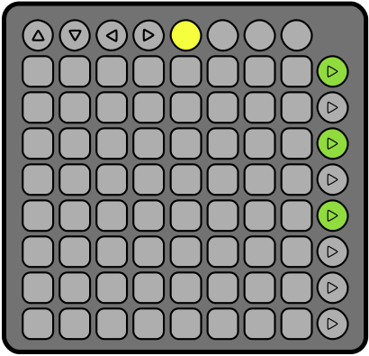

# Flockquencer

The Flockquencer is a browser-based MIDI controller and sequencer. It is designed to be used in combination with a
Novation Launchpad (MK 1), but can also be used independently with only a browser and a sound-producing instrument that
accepts MIDI messages as input.

## Features

The Flockquencer:

1. Provides an 8x8 grid of playable notes, which are tuned by default from C2 to D#7 (see above).
2. Provide octave controls, so that a 112 note range is available (C0 through D#9) for performing.
3. Supports up to 8 user-defined patterns of notes, which can either be used as a sequence or arpeggiation pattern.
4. Supports up to 64 steps per sequence.
5. Supports multiple notes per step.  You can use this for simple chording or octaves, or send any combination of up to
   112 notes per step.
6. Provides independent control over the MIDI channels use for live playing and sequencers.  It can send messages on
   nine channels simultaneously, send all messages on the same channel, or any combination.

## Requirements

1. A browser that supports the WebMIDI standard (Chrome and Opera at time of writing).
2. This package and its dependencies (which can be installed using a command like `npm install`).
3. A software or hardware device that can receive the MIDI messages produced, for example a synthesizer or MIDI
   visualisation tool.

Although it isn't a strict requirement, the Flockquencer works best when paired with a Novation Launchpad MK1.  When
connected to a Launchpad, the lights on the pads will match the onscreen display.

## How do I use this?

By default, the Flockquencer starts in "performance mode".  The [performance mode docs](docs/performance-mode.md) are a
good place to start learning about its features.

Before you can actually make any sounds using the Flockquencer, you will need to connect it to a MIDI output device
using options menu (the gear icon).  See the ["MIDI Connections" documentation](docs/midi-connections.md) for details.

For more details about all features of the Flockquencer, check out any of the following:

* [Performance Mode](docs/performance-mode.md)
* [Entering Patterns](docs/patterns.md).
* [MIDI Channel Controls](docs/midi-channels.md)

## Credits

The Flockquencer makes use of [Flocking](http://flockingjs.org) to implement most of its core features.  Sequencing and
arpeggiation are implemented using [Bergson](https://github.com/colinbdclark/bergson).
