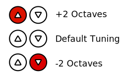

# Creating and Using Patterns

Patterns are a series of steps that are "stepped through" over time.  The speed at which steps are evaluated is
controlled by the tempo controls in [performance mode](performance-mode.md).  Each step represents one beat, so a 12
step pattern running at 60 BPM will be repeated 5 times in a minute.

## Steps

Each step defines the notes which are to be played or not played a particular point in a pattern.  A step may have no
notes (silence) or play up to 112 notes.  Each step may be independent or chained to the previous step.

Independent steps play all of their notes at the beginning of the step, and silence all of their notes at the beginning
of the next step.

Chained steps leave any notes they had in common with the previous step playing, stop playing any notes from the
previous step that are not part of the current step, and start playing any steps that were added in the current step.
If the first step in a pattern is chained, that means that it continues playing any notes it has in common with the
last step of the pattern.

## Creating a Pattern of Steps

Step editing mode (see above) is accessed using the third circular buttom from the right at the top of the interface.
That light is lit when the Flockquencer is in Step editing mode.  Step editing mode is used to control which steps
are played, which steps are silent, and to control the length of the pattern.  The right-hand column controls which
pattern is being edited.  The pattern being edited is always lit.

The first step in a pattern is always represented by the upper left square pad, and the steps continue from left to
right and then top to bottom.  If you are creating a full 64 step pattern, the bottom right square pad is the 64th step.

### Adding/Editing Steps

To add an independent step, simply press an unlit square pad within the pattern.  The step will be lit up in green.

To add a chained step, hold down on an unlit square pad within the pattern until it is lit up in orange.

To clear an independent or chained step, press it and release quickly.

To convert an active (lit) step from an independent step to a chained step (or vice versa), hold down on the pad until
the lighting changes.

### Changing the Pattern Length

Patterns may be as few as 1 step or as many as 64 steps long.  In the UI, the current length of the pattern is indicated
by highlighting any "out of bounds" steps in red.  By default, new patterns are sixteen steps (two rows) long.  You can
change the length of the pattern using the arrow controls.   The left and right arrows change the length of the pattern
by one step at a time.  The up and down arrows change the length of the pattern by one row (8 steps) at a time.

### Changing the Notes Sent for a Step

By default, each new active step contains a single note, which is set to C2.  You can control which notes are sent for
each step using the step note mode, which is accessed using the second circular button from the right on top of the UI.
This button is lit when you are in step note editing mode.

As in step editing mode (see above), the rightmost column of circular buttons is used to select which pattern you are
editing.  The button that corresponds to the selected pattern is lit.

In general, notes that are to be played are highlighted in green, and unplayed notes are unlit.  A note lit in red or
brown represents the position of the step you are editing within the pattern.  If the note is brown, it is unplayed.  If
the note is played, it is red.

Touch an unlit or brown note to add it to the step.  Touch a note lit in red or green to remove it from the step.

You can change which step you are editing using the left and right arrows atop the UI.  You can scroll up or down two
octaves using the up and down arrows atop the UI.  As you change octaves, the display will update to indicate your
octave offset:

Note that the position of the "cursor" that indicates your active step is always relative to the upper-left corner of
the grid of square pads, regardless of the octave you are working with.

## Arpeggiation Patterns

When defining a pattern for use with arpeggiation, keep in mind that the lowest note of the first active step will be
mapped to the played note, and all other notes will be played relative to that note.

So, for example, if you want to play a major chord, you might define a pattern with a single chained step (see above),
whose notes are C2, E2, and G2.  If you use this pattern to arpeggiate and touch G1, the pattern will be shifted from
being relative to C2 to being relative to G1.  The notes G1, B1, and D2 would play until you released the G1 key.

This relative mapping increases the overall range of possible notes.  Let's say, for example, that you have created a
two step pattern.  The first step contains C0 (the lowest note possible to enter) and the second step contains C9 (one
of the highest notes possible to enter).  If you use this pattern to arpeggiate and play a C9 on the keyboard, the first
step will play a C9, and the second step will play a C18.  By inverting the pattern (first step C9, second step C0,
playing note C0), it's possible to play notes as low as C-9.

## Using Patterns

Once you've defined a pattern, you can either use it as a sequence of steps that are played automatically, or you can
use it as an arpeggiation pattern played relative to a note.

See the [performance mode documentation](performance-mode.md) for more details.
