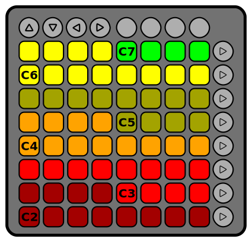
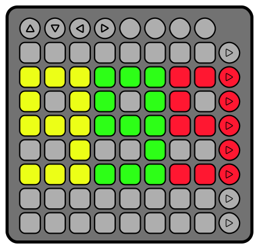

# Performance Mode

Performance mode allows you to play individual notes, start/stop patterns as sequences, and to play a single pattern
as an arpeggiation relative to an individual note.  It is the default mode, but can also be reached from any other
mode using the circular button immediately left of the right arrow.  This button will be lit when the Flockquencer is
in performance mode.

## Playing Notes

The grid of square pads moves from left to right, and then from bottom to top, such that in the default tuning the
bottom left square bad is a C2, and the upper right is a D#7.

The up and down arrows act as octave controls, shifting the tuning up or down by two octaves.  The arrows are lit to
indicate the current offset, as shown here.

The octaves are colour-coded, with the lower-left note in each coloured block representing its C note.

## Sequences and Arpeggiation

The rightmost column of circular buttons controls which patterns are active, and can also be used to select a single
pattern to use as an arpeggiation relative to played notes.  As shown in the diagram, empty pattern slots are
highlighted in red.  Defined pattern slots that are inactive (not playing) are unlit.

To start playing a defined pattern as a sequence, press the corresponding circular button.  Defined patterns slots that
are playing as a sequence are lit in green.  To stop playing a defined pattern, touch the corresponding lit green
button and release.

To start using a defined pattern as an arpeggiation pattern, hold down the corresponding circular button.  If a
button is highlighted in orange, its pattern is currently being used for arpeggiation.  To stop using a pattern for
arpeggiation touch the corresponding lit orange button and release.

## Tempo (BPM) Controls

The tempo (BPM) of both sequences and arpeggiation is controlled using the left and right arrows.  Pressing and
releasing the left arrow quickly will decrease the tempo by 1 BPM.  If you hold in one direction for more than two
seconds, the tempo will change more quickly.

While either the left or right arrow is depressed, the current tempo will be displayed as shown below:

The Flockquencer defaults to 120 BPM.  You can change the tempo to any value from 1 BPM up to and including 999 BPM.
